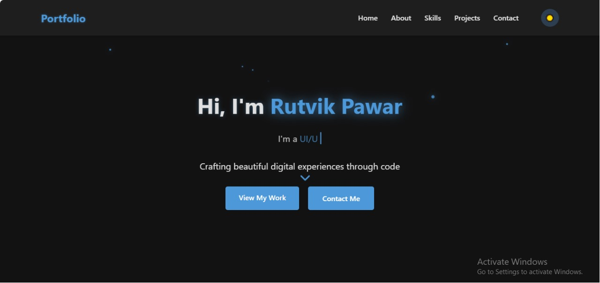

# Modern Portfolio Website

A responsive and interactive personal portfolio website with modern UI features, animations, and dark/light mode support.



## Features

- **Responsive Design**: Fully responsive layout that works on all devices
- **Dark/Light Mode**: Toggle between dark and light themes with persistent user preference
- **Interactive UI Elements**:
  - Floating particles background
  - Glowing text and element effects
  - Smooth scrolling navigation
  - Animated cursor effects
  - Typing animation in hero section
- **Project Filtering**: Filter projects by category (Web Design, App Development, etc.)
- **Animated Sections**: Sections animate as you scroll using AOS (Animate On Scroll)
- **Contact Form**: Includes form validation for the contact section
- **Modern Aesthetics**: Clean design with subtle animations and transitions

## Technologies Used

- **HTML5**: Semantic markup structure
- **CSS3**: Custom properties, flexbox, animations, and responsive design
- **JavaScript**: DOM manipulation, event handling, and animations
- **Font Awesome**: For icons throughout the site
- **Swiper.js**: For the projects slider functionality
- **AOS Library**: For scroll-based animations

## Project Structure

```
├── index.html          # Main HTML file
├── style.css           # CSS styles and theme variables
├── script.js           # JavaScript functionality
└── assets/             # Images and other assets
    └── my.jpg          # Profile picture
```

## Setup and Usage

1. Clone the repository or download the files
2. Open `index.html` in your web browser
3. No build process or dependencies to install - it's ready to use!

## Customization

### Changing Personal Information

- Edit the text in `index.html` to update your name, about section, and project details
- Replace `assets/my.jpg` with your own profile picture

### Modifying the Theme

- Theme colors are defined as CSS variables in the `:root` selector in `style.css`
- Modify the color values to customize the light and dark themes

### Adding Projects

- Copy an existing project card in the projects section of `index.html`
- Update the image, title, description, and tags
- Set the appropriate `data-category` attribute for filtering

## Browser Support

This portfolio is compatible with all modern browsers including:
- Chrome
- Firefox
- Safari
- Edge

## License

Feel free to use this template for your personal portfolio.

## Author

Rutvik Pawar
